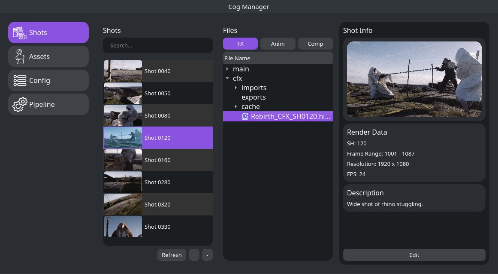
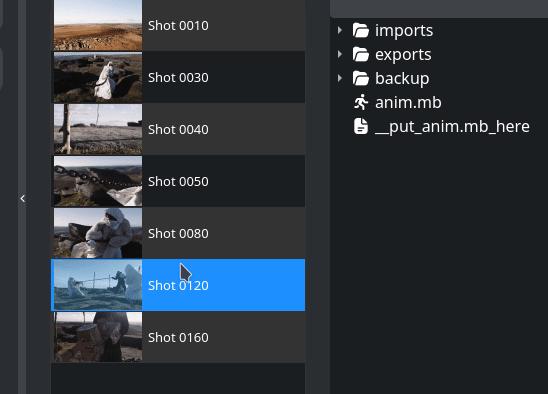

<p align="center">
<a href="https://github.com/bluejamm/cog">
  

</a>
</p>

<h1 align="center">Cog Pipeline</h1>
<p align="center"}>
  
  
  
  
  
</p>

Cog is a **pipeline interface for VFX** and animation specifically designed for the needs of the team of the **[Rebirth](https://www.therookies.co/entries/28123)** student film.  
Because Cog is tailoured to our team's specific needs and built around other tools, it will not fit all use cases or environments.


> **Warning**  
> Cog is in a very early stage of development. It likely will never be in a state to be used publicly.

## Features
- **Cross platform**
  - Cog was built to work across **Windows and Linux**. Mac is not supported.
  - Packaged with PIP
  - Interface built with Qt for Python
- **Rendering**  
  - Local rendering using headless Houdini instances
  - Select individual layers to render  

- **Project Environment Variables**
  - Environment envariables are set when opening project files (Houdini, Maya, Nuke, etc.)
  - Frame range, shot number, fps, description, etc.
- **Search**
  - Users are able to search for specific assets or shots
- **Shot Management**
  - Shots can be created, edited, or deleted through the interface
- **Auto Update**
  - Cog will automatically check for new package versions on your perforce repository and install the latest version
- **Environment Setup**
  - On the first launch Cog will setup the user's envrionment to enable the rest of the pipeline:
    - creating config files, installing houdini packages, setting environment variables, installing python modules for the houdini python interpreter, etc.

## Installation
### Requirements
- Perforce P4
- Sidefx Houdini

First **clone** and **cd** into the repository  
```bash
git clone https://github.com/parkerbritt/cog
cd cog
```
### (Option 1) Interactive installation
Run the **install** command
```bash
pip install -e .
```
### (Option 2) Regular installation
**Build and install** the tar.gz package
```bash
python setup.py sdist
pip install dist/cog_vfx-0.1.tar.gz
```
### Launch Cog
**Run** the cog **command*** in the terminal
```bash
cog
```
You can also create **.desktop** file or **Windows shortcut** to make accessing cog easier
